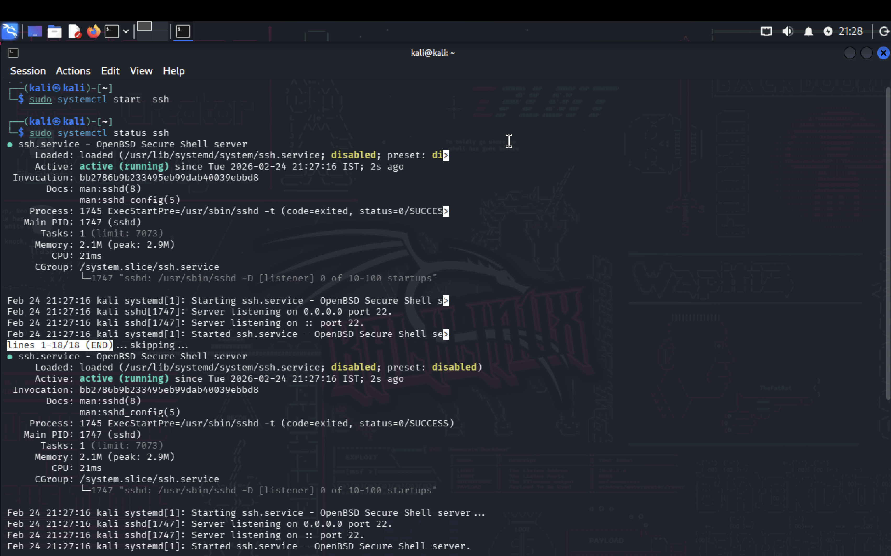
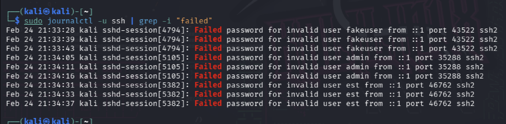
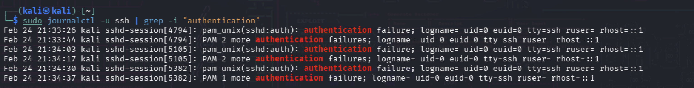
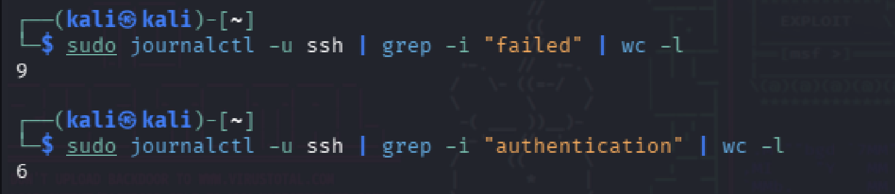

# SSH-Bruteforce-Attack-Investigation

## Environment

- Operating System: Kali Linux
- Platform: UTM (macOS Host)
- Service: SSH
- Service State: Active (running)
- Listening Port: 22
- Log Source: systemd journal (journalctl)

---

## Incident Summary

Multiple failed SSH authentication attempts were detected against a Linux system
within a short time window. The observed activity exhibited characteristics
consistent with a brute-force attack targeting user accounts.

---

## Detection

Suspicious activity was detected through analysis of SSH service logs using the
systemd journal. Multiple failed authentication attempts were observed within a
short time window, targeting several usernames, indicating abnormal and
potentially malicious SSH access behavior.

---

## Log Analysis

Review of SSH authentication logs revealed repeated **"Failed password"** events
for multiple invalid usernames originating from the same source address (`::1`).
A total of **9 failed SSH password attempts** were recorded. The frequency,
consistency, and username variation strongly suggest an automated brute-force
authentication attempt rather than legitimate user behavior.

---

## Authentication Analysis

Additional analysis of PAM authentication logs confirmed repeated authentication
failures enforced by the system. A total of **6 PAM authentication failures**
were recorded, indicating that authentication controls functioned correctly and
successfully prevented unauthorized access. The presence of
`pam_unix(sshd:auth)` failure entries confirms proper enforcement of access
controls.

---

## Investigation Timeline

- SSH service confirmed active and listening on port 22
- Initial failed authentication attempts detected
- Rapid increase in failed login attempts within minutes
- Attempts targeted multiple invalid usernames
- No successful authentication events observed during the activity window

---

## Impact Assessment

No successful SSH authentication events were detected during the investigation.
The attack did not result in unauthorized access. However, continued brute-force
activity poses a risk of credential compromise and potential service exposure if
left unmitigated.

---

## Attack Assessment

The observed activity demonstrates characteristics consistent with an automated
brute-force attack, including repeated authentication failures, username
variation, and short intervals between attempts.

---

## Mitigation & Recommendations

- Disable password-based SSH authentication
- Enforce SSH key-based authentication
- Implement rate limiting or fail2ban for SSH
- Restrict SSH access using firewall rules
- Configure alerts for excessive failed authentication attempts

---

## Lessons Learned

This investigation highlights the importance of continuous log monitoring, early
detection of authentication abuse, and enforcing strong access controls to
reduce the risk of brute-force attacks.

---

## Evidence

## SSH Service Status

## Failed SSH Login Attempts

## Authentication Failures (PAM)

## Failed Attempt Count

